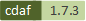

# Common Business Entities (CBE)

The CBE projects goal is to provide practical data governance via a generic schema/API/persistence layer which can be used for all the common functions in an enterprise and extended for each industry/business. CBE can be used to underpin micro-service, SOA, EDA or MDM architecture. In the same area as SAP MDG, CBE provides domain-specific master data governance to centrally create, change and distribute or to consolidate master data across your complete enterprise system landscape.

CBE provides RESTful CRUD and administration for common business entities persisted on relational DBs and (coming soon) NoSQL DBs. This polyglot persistence model forms the backbone of an organisations master data governance. The rationale is discussed in the [Wiki](https://github.com/Semprini/cbe/wiki). 

Industry Specific Extension Projects
 - [Retail](https://github.com/Semprini/cbe-retail)
 - [Utilities (Telco/Energy/Media)](https://github.com/Semprini/cbe-utilities)
 - [Sport](https://github.com/Semprini/cbe-sport)

Sources: TM Fourum SID (Telco), IBM IFW (Finance/Banking), IAA (Insurance)

# How is this different to an API from a product?

It is the role of CBE to express relationships and provide consistent schema for use in multiple contexts. A product will rightly store data for it's own purpose and expose it's data through product oriented APIs, we then use integration architectures like SOA to expose and adjust the semantics for different contexts. 
The CBE persistence layer provides a loosely coupled and practical realization of the data model rather than through a transformation layer. This greatly reduces the impact of product version changes and speeds new feature delivery.

Entity Domains:
- Party - Entities relating to individuals, organizations, how to contact them and the roles they play
- Location - Entities for addresses and places
- Business interaction - Entities for how parties interact in the business
- Customer - The parties that a business sells products or services to
- Trouble - Tracking problems and issues

Coming soon to a data model near you:
- More roles for PartyRole and BusinessInteraction
- Product

The data model is designed to be extended for each industry. In Party, the PartyRole class is the main abstract entity from which concrete classes like Customer or Supplier should be derived.

Check the [Wiki](https://github.com/Semprini/cbe/wiki) for more info. The data model is held in the Docs folder as a Sparx EA model

# Try it out!

Using Windows with either docker-desktop or windows containers, run the CBE

    $id = docker run -d cdaf/cbe
    $ip = (docker inspect -f '{{range .NetworkSettings.Networks}}{{.IPAddress}}{{end}}' $id)
    Write-Host "http://${ip}:8000/admin"

Open the URL returned in your browser and login with the following credentials superuser passw0rd

To stop and remove

    docker stop $id
    docker rm $id

# Development Environment

See cbe subdirectory

# Virtual Desktop Environment

Install CDAF in your user space

    cd ~
    $env:CDAF_INSTALL_PATH = $env:USERPROFILE\cdaf
    . { iwr -useb https://raw.githubusercontent.com/cdaf/windows/master/install.ps1 } | iex

## Windows Containers

For Windows 10

    base.ps1 docker-desktop

For Windows Server

    installDocker.ps1

Clone the repository

    git clone https://github.com/cdaf/cbe.git
    cd cbe

Execute the end-to-end construction, note: if the COMPOSE_KEEP environment variable is not set, the environment will be destroyed automatically after testing is complete

    $env:COMPOSE_KEEP = 'yes'
    entry

Note: If Docker is not available, the emulation will fall back to using native Python on the host

# Make your own fork

    git clone https://github.com/cdaf/cbe.git
    cd cbe
    git remote add upstream https://github.com/Semprini/cbe.git

Once established, use the following to synchronise

    git fetch upstream
    git pull upstream master
